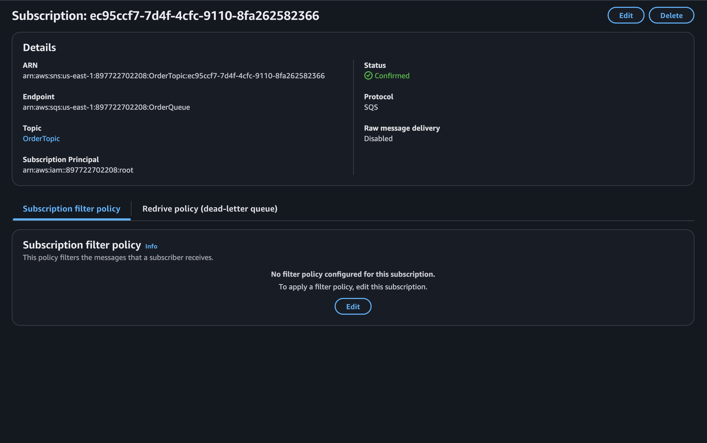

**Project Overview:**

This project implements a cloud-native, event-driven backend system for an e-commerce platform using AWS services. The system is designed to process orders, store them in a DynamoDB table, and send notifications in a scalable and fault-tolerant architecture. It leverages Amazon SNS for messaging, SQS for queuing, AWS Lambda for compute, and DynamoDB for persistent storage.
All infrastructure components are provisioned and managed through AWS CloudFormation.

---

**Architecture Summary:**

The architecture follows this workflow:

1. An order message is published to an SNS topic.
2. SNS delivers the message to an SQS queue via a subscription.
3. The SQS queue triggers an AWS Lambda function.
4. The Lambda function processes the message and inserts it into the DynamoDB table.
5. If the Lambda function fails to process the message after three attempts, the message is redirected to a Dead-Letter Queue (DLQ).

---

**Deployment Instructions:**

**Prerequisites:**

* AWS account with sufficient permissions (CloudFormation, Lambda, SQS, SNS, DynamoDB, IAM).
* `lambda.zip` file uploaded to an accessible S3 bucket:

  ```
  Bucket: cloudformation-momen
  Key: lambda.zip
  ```


**Deployment via CloudFormation:**

1. Download the project files locally, ensuring `template.yaml` is updated with:

```
Code:
  S3Bucket: cloudformation-momen
  S3Key: lambda.zip
```

2. Log in to the **AWS Management Console** and navigate to **CloudFormation → Stacks**.

3. Click **Create stack → With new resources (standard)**.

4. In the “Specify template” step, choose **“Upload a template file”**, then click **“Choose file”** and select your local `template.yaml`.

5. Click **Next**.

6. In the “Specify stack details” step:

   * Enter **Stack name:** `OrderSystemStack`
   * Leave parameters default (unless customization is needed)

7. Click **Next** → then **Next** again (keeping default settings).

8. In the “Review” step, check **“I acknowledge that AWS CloudFormation might create IAM resources”** at the bottom.

9. Click **Create stack**.

10. Monitor the stack creation via **CloudFormation → Stacks**. Wait until the status changes to **CREATE\_COMPLETE**.

---

**Testing Instructions:**

1. Navigate to **AWS SNS → Topics → OrderTopic**.
2. Publish a message with the following JSON body:

```
{
  "orderId": "O9876",
  "userId": "U432",
  "itemName": "Tablet",
  "quantity": 3,
  "status": "new",
  "timestamp": "2025-05-09T14:40:00Z"
}
```

3. Validate successful processing by verifying:

* The message is consumed from the SQS queue.
* The order is inserted into the DynamoDB `Orders` table.
* The Lambda function logs show a successful insertion.

---

**Deliverables Checklist:**

- [x] **SNS Topic + Subscription**  
    
  

- [x] **SQS Queue with Visible Message**  
  
  

- [x] **DynamoDB Table with Inserted Item**  
  


---

**Manual Deployment (Optional):**

Alternatively, the resources can be created manually via AWS Console, following these steps:

1. Create DynamoDB table `Orders` with `orderId` as the partition key.
2. Create SNS topic `OrderTopic`.
3. Create SQS queue `OrderQueue` and DLQ `DLQ`.
4. Subscribe `OrderQueue` to `OrderTopic`.
5. Deploy a Lambda function with:

   * Runtime: Python 3.12
   * Handler: `lambda_function.lambda_handler`
   * Code package: `lambda.zip`
   * Attached IAM role with:

     * `AmazonDynamoDBFullAccess`
     * `AWSLambdaBasicExecutionRole`
     * Inline policy permitting `sqs:ReceiveMessage`, `sqs:DeleteMessage`, `sqs:GetQueueAttributes` on `OrderQueue`.
6. Configure an SQS trigger on the Lambda function from `OrderQueue`.

---

**Troubleshooting:**

* If CloudFormation deployment fails due to existing resources, delete conflicting resources or adjust resource names in `template.yaml`.
* Ensure the S3 bucket permissions allow CloudFormation and Lambda services to access `lambda.zip`.
* Use CloudWatch Logs to diagnose Lambda execution issues.

